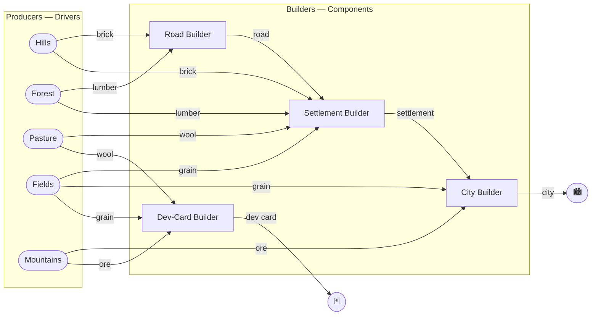

[](https://github.com/ajakhotia/nioc/actions/workflows/docker-image.yaml)

# nioc — Nerve IO Core

**A C++ framework for apps where lots of things produce data and lots of things consume it.**

Robots, sensor pipelines, trading stacks, simulations — they're all graphs of producers and
consumers. The hard part is never the work each piece does; it's the **wiring**: threads, queues,
back-pressure, shutdown, who-talks-to-whom. nioc takes that off your plate.

You write small **routines** that **publish** and **subscribe** to named **topics**. nioc gives each
routine its own thread, delivers every message to every subscriber, and shuts the whole graph down
cleanly on Ctrl-C. Routines never reference each other — only topic names — so you can add, remove,
or re-tune one without touching the rest.

### The whole model is two kinds of routine

- **Driver** — *produces.* Pulls data from a sensor, socket, or clock and publishes it.
- **Component** — *reacts.* Subscribes to topics, handles each message, and may publish results.
  (A consumer that's usually also a producer.)

A routine publishes a message — say a camera frame — to a topic like `"camera"`; everyone subscribed
to `"camera"` gets it. That's fan-out, fan-in, and chaining, all from one mechanism. Messages are
plain structs you define in a tiny schema file (via [Cap'n Proto](https://capnproto.org), like
Protocol Buffers).

### One publish = distribute **and** record, with zero copies

This is what makes nioc fit **high-volume** data, and it's the heart of the system. You never
serialize a message and hand it off. You build it **directly into a file-backed, memory-mapped
region** — and that one region is, at the same instant:

- **handed to every subscriber** as a shared-ownership `const` view — no copy, every consumer reads
  the *very same bytes*; and
- **the on-disk recording** of the run — the log *is* that mapped region.

There is no separate "write to disk" step and no serialization on the hot path: the **OS kernel's
paging** streams the mapping out to storage in the background. So a single write becomes every
subscriber's read *and* the durable, replayable log — simultaneously. Throughput is bounded by memory
bandwidth and your disk, not by per-message copies. That is exactly what you want for camera frames,
LiDAR, point clouds, and other firehose streams — and it means **every run is recorded and can be
replayed**, bit-for-bit, for free.

---

## See it: a Catan supply chain

The runnable [`modules/example`](modules/example) is a whole nioc app modeled on *Settlers of Catan* —
a producer/consumer graph you already know. Land tiles **produce** resources; builders **spend** them
to make roads, settlements, and cities.



Every arrow is a topic. `grain` fans out to three builders; the settlement builder fans in five
inputs; builders chain into builders. No producer knows who consumes its output, and no builder knows
where its inputs came from — nioc does the delivery.

**A whole producer** ([`hills.hpp`](modules/example/include/nioc/example/hills.hpp)):

```cpp
class Hills final: public terminus::Driver
{
  State run() final   // called repeatedly on its own thread
  {
    // A real driver blocks here on a socket or device read. Here it just waits.
    if(common::sleepFor(shutdownToken(), std::chrono::milliseconds{mConfig.getMiningTimeMs()}))
      return State::Done;

    auto brick = mBrickPublisher.draft();
    brick.builder().setId(++mNextBrickId);
    mBrickPublisher.publish(std::move(brick));   // → everyone subscribed to "brick"
    return State::Continue;
  }
};
```

**A consumer** subscribes to its inputs and publishes its output
([`roadBuilder.cpp`](modules/example/src/roadBuilder.cpp)):

```cpp
RoadBuilder::RoadBuilder(terminus::Port& port, RoadBuilderConfig::Reader config): Component{port, config.getComponent()}
{
  subscribe<Brick>("brick",   [this](const Message<Brick>& m)  { process(m); return State::Continue; });
  subscribe<Lumber>("lumber", [this](const Message<Lumber>& m) { process(m); return State::Continue; });
}
```

The whole graph — every routine, every thread — is assembled in one file,
[`catanMain.cpp`](modules/example/src/catanMain.cpp). Read the
[example walkthrough](modules/example/README.md), then run it:

```shell
cmake --build <BUILD_TREE> --target catanMain
<INSTALL_TREE>/bin/catanMain                                          # built-in defaults
<INSTALL_TREE>/bin/catanMain --config-override fields.miningTimeMs=250   # retune a producer, live
```

Every finished piece prints as it's built. Ctrl-C to stop.

---

## What's in the box

nioc is a modular super-build; depend only on what you use. The two you'll touch first:

- **`nioc::terminus`** — the runtime. `Port` (the pub/sub bus + run lifecycle), `Driver`, `Component`,
  `Publisher`/`Message`, and config (`Manifest`, layered `defaults → file → key=value`, read live).
- **`nioc::concurrent`** — the threading underneath. `ThreadedRunner` (one thread per routine) and a
  family of multi-producer queues.

Supporting modules: **`chronicle`** (memory-mapped recording & replay of every message),
**`logger`**, **`common`** (`Locked<T>`, time/sleep, type traits), **`geometry`** (frames &
transforms on Eigen), **`containers`** (mmap-backed arrays). C++23, GNU & Clang, Ubuntu 22.04+, all
targets exported under the `nioc::` namespace.

---

## Using nioc in your project

### Option A — Vendor it as a submodule (recommended for building *on* nioc)

Add nioc and its build-infra dependency `infraCommons` as submodules; your build configures and builds
them with your own. nioc keeps its tooling setup behind a `PROJECT_IS_TOP_LEVEL` guard, so as a
submodule it won't reach out and configure clang-tidy, codegen, etc. — that becomes your top-level
project's job, which is why you also vendor `infraCommons` (nioc's CMake utilities) and wire it in.

```shell
git submodule add git@github.com:ajakhotia/infraCommons.git external/infraCommons
git submodule add git@github.com:ajakhotia/nioc.git         external/nioc
git submodule update --init
```

In your top-level `CMakeLists.txt`, set up the infra utilities, then add nioc:

```cmake
cmake_minimum_required(VERSION 3.27)
project(myApp VERSION 0.0.0 LANGUAGES C CXX)

# nioc (as a submodule) expects its parent to provide the infraCommons CMake utilities.
include(external/infraCommons/cmake/utilities/capnprotoGenerate.cmake)
include(external/infraCommons/cmake/utilities/clangFormat.cmake)
include(external/infraCommons/cmake/utilities/clangTidy.cmake)
include(external/infraCommons/cmake/utilities/exportedTargets.cmake)
include(external/infraCommons/cmake/utilities/requireArguments.cmake)

add_clang_format(TARGET clangFormat VERSION 22)
add_clang_tidy(TARGET clangTidy VERSION 22)

add_subdirectory(external/nioc)   # contributes the nioc:: libraries

add_executable(myApp src/main.cpp)
target_link_libraries(myApp PRIVATE nioc::terminus nioc::concurrent nioc::logger)
target_compile_features(myApp PRIVATE cxx_std_23)
```

Configure with an infraCommons toolchain, pointing at your dependency install tree (see
[External dependencies](#external-dependencies)):

```shell
cmake -G Ninja -S . -B build                                                \
  --toolchain external/infraCommons/cmake/toolchains/linux-clang-22.cmake   \
  -DCMAKE_PREFIX_PATH=${ROBOT_FARM_INSTALL_TREE} -DCMAKE_BUILD_TYPE=Release
cmake --build build
```

Your `main.cpp` follows the same shape as [`catanMain.cpp`](modules/example/src/catanMain.cpp): build
a `Manifest`, construct a `Port` whose setup hook creates your drivers and components, and park
`main` until shutdown.

### Option B — Install it, then `find_package`

Build and install nioc standalone (below), then from any project:

```cmake
find_package(nioc REQUIRED)
target_link_libraries(myApp PRIVATE nioc::terminus nioc::concurrent nioc::logger)
```

Point CMake at the install tree with `-DCMAKE_PREFIX_PATH=${INSTALL_TREE}`. nioc ships a standard
package config that re-finds its public dependencies for you.

---

## Build & install nioc

**Tested on Ubuntu 22.04 / 24.04. See [`docker/ubuntu.dockerfile`](docker) for the exact recipe.**
Pick three paths you own — `SOURCE_TREE` (clone), `BUILD_TREE` (build), `INSTALL_TREE` (install,
keep long-term). Installing to a privileged location (`/opt`, `/usr`) needs `sudo` on the build step,
since this super-build also installs child libraries; prefer an unprivileged path.

```shell
export SOURCE_TREE=${HOME}/sandbox/nioc
export BUILD_TREE=${SOURCE_TREE}/build
export INSTALL_TREE=${HOME}/opt/nioc
git clone git@github.com:ajakhotia/nioc.git ${SOURCE_TREE}
git -C ${SOURCE_TREE} submodule update --init
```

### Toolchain

Requires GNU ≥ 12 **or** Clang ≥ 22 (CUDA ≥ 13 if used). Skip any step your system already
satisfies. The setup scripts live in the `infraCommons` submodule.

```shell
sudo apt install -y --no-install-recommends jq          # to read systemDependencies.json
sudo bash external/infraCommons/tools/installCMake.sh    # skip if cmake > 3.27
sudo apt install -y --no-install-recommends \
  $(sh external/infraCommons/tools/extractDependencies.sh Basics systemDependencies.json)

# Newer toolchains (skip if your OS compilers are new enough):
sudo bash external/infraCommons/tools/apt/addGNUSources.sh    -y
sudo bash external/infraCommons/tools/apt/addLLVMSources.sh   -y
sudo bash external/infraCommons/tools/apt/addNvidiaSources.sh -y
sudo apt update && sudo apt install -y --no-install-recommends \
  $(sh external/infraCommons/tools/extractDependencies.sh Compilers systemDependencies.json)
```

### External dependencies

nioc needs Boost (headers, iostreams, program_options), Cap'n Proto, Eigen3, GoogleTest, Nlohmann
JSON, and Spdlog. The easiest way to get them is
[robotFarm](https://github.com/ajakhotia/robotFarm):

```shell
export ROBOT_FARM_INSTALL_TREE=/opt/robotFarm
curl -fsSL https://raw.githubusercontent.com/ajakhotia/robotFarm/refs/heads/main/tools/quickBuild.sh | \
  sudo bash -s -- --version v2.2.0 --toolchain linux-clang-22 --prefix ${ROBOT_FARM_INSTALL_TREE} \
    --build-list "BoostExternalProject;Eigen3ExternalProject;NlohmannJsonExternalProject;GoogleTestExternalProject;SpdLogExternalProject;CapnprotoExternalProject"
```

This compiles the dependencies from source — expect it to run for a while (tens of minutes).

### Configure, build, install

Pass a `--toolchain` file so a C++23-capable compiler is used — the OS-default compiler (e.g. GCC
11.4 on Ubuntu 22.04) is too old and the build will fail partway. This mirrors the proven recipe in
[`docker/ubuntu.dockerfile`](docker).

```shell
cmake -G Ninja -S ${SOURCE_TREE} -B ${BUILD_TREE}                                   \
  --toolchain ${SOURCE_TREE}/external/infraCommons/cmake/toolchains/linux-clang-22.cmake \
  -DCMAKE_BUILD_TYPE=Release                                                        \
  -DCMAKE_INSTALL_PREFIX=${INSTALL_TREE}                                            \
  -DCMAKE_POSITION_INDEPENDENT_CODE=ON                                              \
  -DCMAKE_PREFIX_PATH=${ROBOT_FARM_INSTALL_TREE}
cmake --build   ${BUILD_TREE}
cmake --install ${BUILD_TREE}
```

Use `CMAKE_BUILD_TYPE=Debug` for debug builds, or `linux-gnu-15.cmake` for the GNU toolchain. To
build nioc itself as shared libraries (`-DBUILD_SHARED_LIBS=ON`), your dependencies must also be
position-independent — keep `CMAKE_POSITION_INDEPENDENT_CODE=ON` above.

---

## Contributing

PRs welcome — follow the conventions: members `mCamelCase`, compile-time constants `kCamelCase`,
types `PascalCase`, everything else (including filenames) `camelCase`. CMake auto-detects
`clang-format-22`/`clang-tidy-22` and creates the `clangFormat` / `clangTidy` targets.

## License

[MIT](LICENSE) © 2025 Anurag Jakhotia, with restrictions on commercial use.
