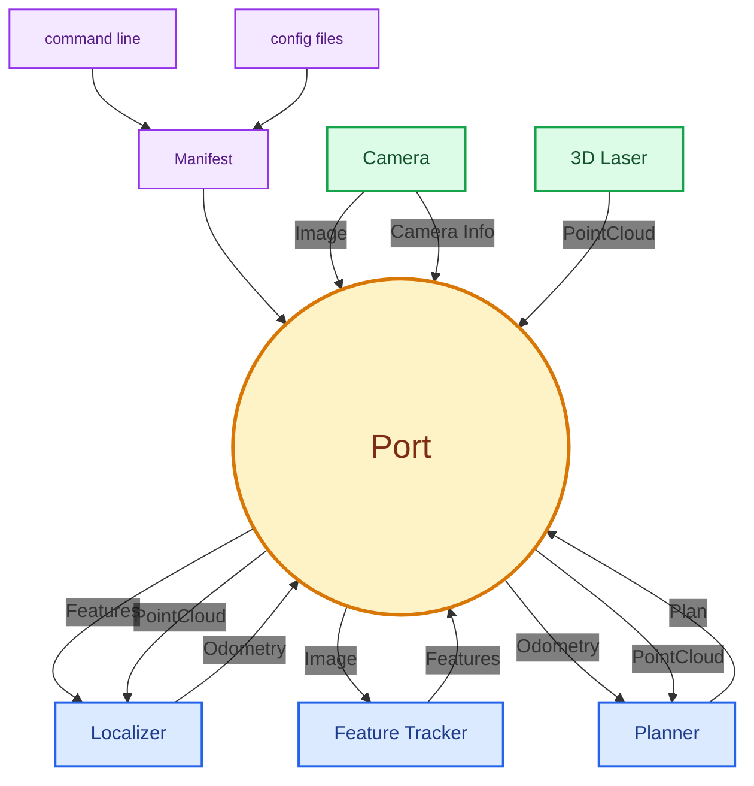
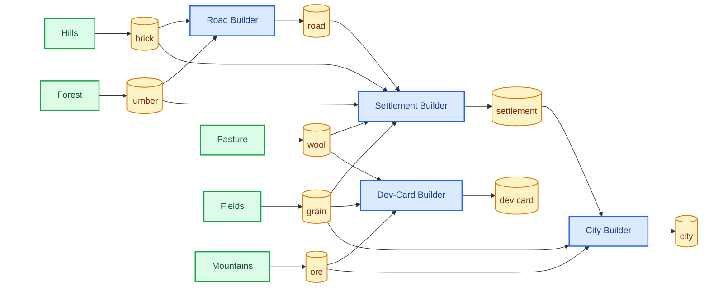

<h1 align="center">nioc: Nerve IO Core</h1>

<p align="center">
  <strong>An in-process pub/sub runtime for C++<br/>
  zero-copy message distribution&nbsp;&nbsp;·&nbsp;&nbsp;zero-copy logging</strong>
</p>

<p align="center">
  <a href="https://github.com/ajakhotia/nioc/actions/workflows/dev-base-image.yaml"></a>
  <a href="https://github.com/ajakhotia/nioc/actions/workflows/docker-image.yaml"></a>
  
  
  
</p>

***nioc*** composes an application from subsystems that communicate through typed messages, built
on Cap'n Proto, with each topic flowing from one producer to any number of consumers.

A message is drafted in place, directly on a memory-mapped file, and distributed as a const view
of the written bytes. The Linux kernel manages the page sync, leaving behind a replayable log on
disk. **The data log doubles as the message bus. Publish, subscribe, and record share one
zero-copy path, built for high-bandwidth applications.**

The system consists of two kinds of routine: **Drivers** & **Components**.

- A **Driver** produces: it pulls from a socket, a device, or a clock, and publishes to a topic.
- A **Component** consumes: it subscribes to topics, reacts, and may publish onward.

**Runners** are allocated per routine. The choice of Runner sets the execution context: the stock
`ThreadedRunner` dedicates a thread to its routine, and the abstraction admits others, such as a
shared thread pool.

<table>
<tr>
<th align="left">Driver</th>
<th align="left">Component</th>
</tr>
<tr>
<td>

```cpp
class Camera: public Driver
{
public:
  Camera(Port& port):
    Driver(port, "cameraDriver"),
    mImagePublisher(publisher<Image>("/front/rgb"))
  {
  }

private:
  Publisher<Image> mImagePublisher;

  State run() override
  {
    // Allocate on the mmapped region.
    auto draft = mImagePublisher.draft();

    // Acquire a writer to build the message.
    auto imageBuilder = draft.builder();

    // Build your message as you see fit ( . . . ).

    if(fatalError)
    {
      return State::Done;
    }

    // Publish the message to the subscribers.
    mImagePublisher.publish(std::move(draft));

    // Let the system know to keep going.
    return State::Continue;
  }
};
```

</td>
<td>

```cpp
class Tracker: public Component
{
public:
  Tracker(Port& port):
    Component(port, 64, BufferMode::Overwriting, "tracker"),
    mFeaturePublisher(publisher<Features>("/front/tracking"))
  {
    // Subscribe to the topic.
    subscribe<Image>(
        "/front/rgb",
        [this](const Message<Image>& image)
        {
          return processImage(image);
        });
  }

private:
  Publisher<Features> mFeaturePublisher;

  State processImage(const Message<Image>& image)
  {
    // Acquire a reader to read the message.
    const auto imageReader = image.reader();

    // Allocate on the mmapped region and acquire a builder.
    auto draft = mFeaturePublisher.draft();
    auto featureBuilder = draft.builder();

    // Compute the features from the image ( . . . )

    mFeaturePublisher.publish(std::move(draft));
    return State::Continue;
  }
};
```

</td>
</tr>
<tr>
<th align="left" colspan="2">Main</th>
</tr>
<tr>
<td colspan="2">

```cpp
int main(int argc, char** argv)
{
  const auto programName = nioc::common::programName(argc, argv);
  nioc::logger::setupDefaultLogger(programName);

  auto options = nioc::terminus::programOptions(programName);
  options.add(nioc::terminus::Manifest::cliOptions());
  const auto variableMap = nioc::terminus::parseCommandLine(argc, argv, options);

  auto manifest = nioc::terminus::Manifest{
      variableMap,
      capnp::Schema::from<AppConfig>()}; // AppConfig is defined as a Cap'n Proto schema.

  // The Port owns the run; its setup hook wires the graph.
  auto port = Port{
      std::move(manifest),
      [](Port& port, Drivers& drivers, Components& components, Runners& runners)
      {
        // One runner per routine; the consumer launches before the producer.
        auto tracker = std::make_shared<Tracker>(port);
        auto trackerRunner = std::make_shared<ThreadedRunner>();
        trackerRunner->launch(tracker);

        auto camera = std::make_shared<Camera>(port);
        auto cameraRunner = std::make_shared<ThreadedRunner>();
        cameraRunner->launch(camera);

        // Hand ownership to the Port; teardown destroys drivers, then components,
        // then runners.
        components.push_back(std::move(tracker));
        drivers.push_back(std::move(camera));
        runners.push_back(std::move(trackerRunner));
        runners.push_back(std::move(cameraRunner));
      }};

  // Setup the signal catcher. Ctrl-C once for a graceful shutdown, twice to abort.
  const auto signalCatcher = defaultSignalCatcher(port);

  // Park main until the run winds down.
  while(port.wait(std::chrono::milliseconds{10}, [] {}))
  {
  }
}
```

</td>
</tr>
</table>

Run the program and a directory appears:

```
<log-root>/<utc-timestamp>_<uuid>/
    manifest.json    the command line that launched this run
    config.json      the fully resolved configuration
    console.log      everything the run logged
    topics.txt       every topic published, with its schema
    resources.json   the input files the run copied in, kept beside it
    chronicle/       every message, byte for byte, in write order
```

> 🐧 **Platform:** Linux (tested on Ubuntu 22.04 / 24.04), C++23, built with Clang 22 or GCC 15.

---

## 📐 Design

### 📡 Comms

Everything meets at the **`Port`**. Drivers and Components connect to it by opening publishers and
subscriptions on named topics. The Port fans every published message out to the topic's
subscribers and records it. It also manages the working directory, the config, the
recording, and the shutdown process.

At construction, the command line and config files decode into a `Manifest`: a `RunContext` (how
the run was launched) plus a `ConfigStore` (the resolved config). The Manifest moves into the
Port, and routines read their settings from that one store.


```mermaid
%%{init: {"themeVariables": {"edgeLabelBackground": "transparent"}, "themeCSS": ".edgeLabel { font-size: 10px; }"}}%%
flowchart TB
  classDef input     fill:#f3e8ff,stroke:#9333ea,stroke-width:1.5px,color:#581c87,font-size:13px;
  classDef driver    fill:#dcfce7,stroke:#16a34a,stroke-width:2px,color:#14532d;
  classDef component fill:#dbeafe,stroke:#2563eb,stroke-width:2px,color:#1e3a8a;
  classDef port      fill:#fef3c7,stroke:#d97706,stroke-width:3px,color:#7c2d12,font-size:28px;

  CLI["command line"]:::input
  FILES["config files"]:::input
  MANIFEST["Manifest"]:::input

  CAM["Camera"]:::driver
  LASER["3D Laser"]:::driver

  PORT(("&nbsp;&nbsp;&nbsp;&nbsp;&nbsp;&nbsp;&nbsp;&nbsp;&nbsp;&nbsp;&nbsp;&nbsp;&nbsp;&nbsp;Port&nbsp;&nbsp;&nbsp;&nbsp;&nbsp;&nbsp;&nbsp;&nbsp;&nbsp;&nbsp;&nbsp;&nbsp;&nbsp;&nbsp;")):::port


  LOC["Localizer"]:::component
  TRK["Feature Tracker"]:::component
  PLN["Planner"]:::component

  CLI --> MANIFEST
  FILES --> MANIFEST
  MANIFEST --> PORT

  CAM -- "Image" --> PORT
  CAM -- "Camera Info" --> PORT
  LASER -- "PointCloud" --> PORT

  PORT -- "Features" --> LOC
  PORT -- "PointCloud" --> LOC
  LOC -- "Odometry" --> PORT

  PORT -- "Image" --> TRK
  TRK -- "Features" --> PORT

  PORT -- "Odometry" --> PLN
  PORT -- "PointCloud" --> PLN
  PLN -- "Plan" --> PORT
```

- **⏪ Recording and replay.** Every publish is recorded by construction; a `LogPlayer` replays a
  chronicle onto the same topics, in recorded order.
- **🚦 Backpressure by policy.** A publisher never blocks. Each component's inbox either keeps the
  newest N messages (dropping the oldest) or grows unbounded; the policy decides what a slow
  consumer misses.

### ⚙️ Configuration

An application's configuration is declared in a Cap'n Proto schema, which the Cap'n Proto
compiler turns into typed structs (`Reader` & `Builder`). Every routine reads its settings
through the generated `<Schema>::Reader`. In Cap'n Proto, a reader is a highly efficient,
read-only typed view over a set of bytes. In nioc, those bytes are owned by the `ConfigStore`
and are guaranteed to stay valid until the `Port` is destroyed.

The generated `Reader` and `Builder` are backward compatible by Cap'n Proto's own design. An
application knows exactly which configuration values it reads, and any extra or stray values
are ignored.

At launch, the effective configuration resolves in three layers, each overriding the one before.
The two override mechanisms are command-line options that every nioc application accepts out of
the box.

#### Schema defaults

Every configuration value in the schema carries a default. The `ConfigStore`'s bytes are
default-initialized so that the `<Schema>::Reader` returns these defaults. When no overrides are
supplied, the program runs on the default configuration.

#### Command-line config files

A caller may override any part of the schema-default config by supplying one or more JSON files,
each mirroring the structural layout of the schema and overriding it partially or fully. Pass
`--append-config </path/to/myOverrides.json>` as many times as needed. The files merge-patch onto
the schema defaults from left to right, and on collision the later file wins.

#### Command-line overrides

A caller may override individual values with the `--config-override key=value` option, repeated
as many times as needed. These also merge-patch from left to right. They are applied last, so
they override both the appended config files and the schema defaults.

The effective config decodes into the `ConfigStore` as one block of bytes in Cap'n Proto wire
format, ready for every `<Schema>::Reader` to view. The same values are echoed into the run's
working directory as a single `config.json`, so a replay of the log runs with the exact
configuration the original run used.

Since every `Reader` is an efficient read-only view over the `ConfigStore`'s bytes, manipulating
the right bits of that byte span reconfigures the corresponding subsystem in place. As a result, the system
can be tuned live. A planned control panel will do exactly that by wrapping a `<Schema>::Builder`
in a GUI.

---

## 🎲 Example: A Settlers of Catan Supply Chain

The runnable [`modules/example`](modules/example) is a complete nioc application modeled on
*Settlers of Catan*. Five land tiles produce resources, and four builders spend them on roads,
settlements, cities, and development cards. The graph is small enough to read in one sitting,
yet it has the shapes a production dataflow is made of.


```mermaid
flowchart LR
  classDef driver    fill:#dcfce7,stroke:#16a34a,stroke-width:2px,color:#14532d;
  classDef component fill:#dbeafe,stroke:#2563eb,stroke-width:2px,color:#1e3a8a;
  classDef topic     fill:#fef3c7,stroke:#d97706,stroke-width:1.5px,color:#7c2d12;
  classDef anchor    fill:transparent,stroke:transparent,color:transparent;

  %% Hidden anchor pins every producer into the first column.
  a0(( )):::anchor
  a0 ~~~ Hills & Forest & Pasture & Fields & Mountains

  Hills["Hills"]:::driver
  Forest["Forest"]:::driver
  Pasture["Pasture"]:::driver
  Fields["Fields"]:::driver
  Mountains["Mountains"]:::driver

  brick[("brick")]:::topic
  lumber[("lumber")]:::topic
  wool[("wool")]:::topic
  grain[("grain")]:::topic
  ore[("ore")]:::topic

  RB["Road Builder"]:::component
  DC["Dev-Card Builder"]:::component
  SB["Settlement Builder"]:::component
  CB["City Builder"]:::component

  road[("road")]:::topic
  devcard[("dev card")]:::topic
  settlement[("settlement")]:::topic
  city[("city")]:::topic

  Hills --> brick
  Forest --> lumber
  Pasture --> wool
  Fields --> grain
  Mountains --> ore

  brick --> RB
  lumber --> RB
  brick --> SB
  lumber --> SB
  wool --> SB
  grain --> SB
  wool --> DC
  grain --> DC
  ore --> DC
  ore --> CB
  grain --> CB

  RB --> road
  DC --> devcard
  SB --> settlement
  CB --> city

  road --> SB
  settlement --> CB
```

🟩 **Drivers**
🟦 **Components**
🟨 **Topics**

- **Fan-out:** `grain` feeds three builders.
- **Fan-in:** the settlement builder consumes five topics.
- **Pipelines:** builders feed builders. Roads flow into the settlement builder, and settlements
  flow into the city builder.

The whole supply chain wires up in one setup hook, verbatim from
[`catanMain.cpp`](modules/example/src/catanMain.cpp):

```cpp
// The Port owns the run. Its constructor calls this hook to build the routine graph, handing
// each routine only its own config block.
auto port = nioc::terminus::Port{
    std::move(manifest),
    [](nioc::terminus::Port& port,
       nioc::terminus::Port::Drivers& drivers,
       nioc::terminus::Port::Components& components,
       nioc::terminus::Port::Runners& runners)
    {
      const auto config = port.config<nioc::example::CatanConfig>();

      // Components (consumers).
      components.push_back(
          std::make_shared<nioc::example::RoadBuilder>(port, config.getRoadBuilder()));
      components.push_back(
          std::make_shared<nioc::example::SettlementBuilder>(
              port,
              config.getSettlementBuilder()));
      components.push_back(
          std::make_shared<nioc::example::CityBuilder>(port, config.getCityBuilder()));
      components.push_back(
          std::make_shared<nioc::example::DevelopmentCardBuilder>(
              port,
              config.getDevelopmentCardBuilder()));

      // Drivers (producers).
      drivers.push_back(std::make_shared<nioc::example::Hills>(port, config.getHills()));
      drivers.push_back(std::make_shared<nioc::example::Forest>(port, config.getForest()));
      drivers.push_back(std::make_shared<nioc::example::Pasture>(port, config.getPasture()));
      drivers.push_back(std::make_shared<nioc::example::Fields>(port, config.getFields()));
      drivers.push_back(
          std::make_shared<nioc::example::Mountains>(port, config.getMountains()));

      // Launch consumers before producers, so no message is published before its subscriber's
      // runner is up. Each routine gets its own thread.
      for(const auto& component: components)
      {
        auto runner = std::make_shared<nioc::concurrent::ThreadedRunner>();
        runner->launch(component);
        runners.push_back(std::move(runner));
      }
      for(const auto& driver: drivers)
      {
        auto runner = std::make_shared<nioc::concurrent::ThreadedRunner>();
        runner->launch(driver);
        runners.push_back(std::move(runner));
      }
    }};
```

Every knob (mining times, recipe costs, topic names) is a field in
[`catanConfig.capnp`](modules/example/include/nioc/example/config/catanConfig.capnp), one config
block per routine; the `config.getRoadBuilder()` calls above hand each routine its typed view.
That makes the example a working demonstration of the three layers from **⚙️ Configuration**
(`BUILD_TREE` / `INSTALL_TREE` are the paths you set up under **Build & install nioc** below):

```shell
cmake --build <BUILD_TREE> && cmake --install <BUILD_TREE>

# 1. Schema defaults alone.
<INSTALL_TREE>/bin/catanMain

# 2. A config file overrides only the settings it names.
<INSTALL_TREE>/bin/catanMain --append-config <INSTALL_TREE>/config/nioc/example/strippedCatan.json

# 3. A command-line override flips one setting.
<INSTALL_TREE>/bin/catanMain --config-override fields.miningTimeMs=250
```

Every finished piece prints as it is built. Ctrl-C stops the run cleanly; a second Ctrl-C aborts it.
The [example walkthrough](modules/example/README.md) gives the full tour.

---

## 🔧 Using nioc in your project

nioc is a modular CMake build with all targets exported under the `nioc::` namespace; depend only
on what you use.

### 🅰️ Option A: vendor it as a submodule (recommended for building *on* nioc)

Add nioc and its build-infra dependency `infraCommons` as submodules; your build configures and
builds them with your own.

nioc keeps its tooling setup behind a `PROJECT_IS_TOP_LEVEL` guard, so as a submodule it won't
reach out and configure clang-tidy, codegen, etc. Your top-level project owns that, which is why
you also vendor `infraCommons` (nioc's CMake utilities) and wire it in.

```shell
git submodule add https://github.com/ajakhotia/infraCommons.git external/infraCommons
git submodule add https://github.com/ajakhotia/nioc.git         external/nioc
git submodule update --init
```

In your top-level `CMakeLists.txt`, set up the infra utilities, then add nioc:

```cmake
cmake_minimum_required(VERSION 3.27)
project(myApp VERSION 0.0.0 LANGUAGES C CXX)

# nioc (as a submodule) expects its parent to provide the infraCommons CMake utilities.
include(external/infraCommons/cmake/utilities/capnprotoGenerate.cmake)
include(external/infraCommons/cmake/utilities/clangFormat.cmake)
include(external/infraCommons/cmake/utilities/clangTidy.cmake)
include(external/infraCommons/cmake/utilities/exportedTargets.cmake)
include(external/infraCommons/cmake/utilities/requireArguments.cmake)

add_clang_format(TARGET clangFormat VERSION 22)
add_clang_tidy(TARGET clangTidy VERSION 22)

add_subdirectory(external/nioc)   # contributes the nioc:: libraries

add_executable(myApp src/main.cpp)
target_link_libraries(myApp PRIVATE nioc::terminus nioc::concurrent nioc::logger)
target_compile_features(myApp PRIVATE cxx_std_23)
```

You'll first need the toolchain and dependencies set up, so do the **Toolchain** and
**External dependencies** steps below once. Then configure with an infraCommons toolchain, pointing
at your dependency install tree:

```shell
cmake -G Ninja -S . -B build                                                \
  --toolchain external/infraCommons/cmake/toolchains/linux-clang-22.cmake   \
  -DCMAKE_PREFIX_PATH=${ROBOT_FARM_INSTALL_TREE} -DCMAKE_BUILD_TYPE=Release
cmake --build build
```

Your `main.cpp` follows the same shape as [`catanMain.cpp`](modules/example/src/catanMain.cpp):
build a `Manifest`, construct a `Port` whose setup hook creates your drivers and components, and
park `main` until shutdown.

### 🅱️ Option B: install it, then `find_package`

Build and install nioc standalone (below), then from any project:

```cmake
find_package(nioc REQUIRED)
target_link_libraries(myApp PRIVATE nioc::terminus nioc::concurrent nioc::logger)
```

Point CMake at both install trees: `-DCMAKE_PREFIX_PATH="${INSTALL_TREE};${ROBOT_FARM_INSTALL_TREE}"`.
nioc's package config re-finds its public dependencies, so the tree that holds them must be on the
prefix path too.

---

## 🛠️ Build & install nioc

**Tested on Ubuntu 22.04 / 24.04. See [`docker/ubuntuDevBase.dockerfile`](docker) for the exact
recipe.**

Pick three paths you own: `SOURCE_TREE` (clone), `BUILD_TREE` (build), and `INSTALL_TREE` (install,
keep long-term). Installing to a privileged location (`/opt`, `/usr`) needs `sudo` on the install
step; prefer an unprivileged path.

```shell
export SOURCE_TREE=${HOME}/sandbox/nioc
export BUILD_TREE=${SOURCE_TREE}/build
export INSTALL_TREE=${HOME}/opt/nioc
git clone https://github.com/ajakhotia/nioc.git ${SOURCE_TREE}
git -C ${SOURCE_TREE} submodule update --init
```

### 🧰 Toolchain

Requires a C++23-capable toolchain. Toolchain files ship for GNU 14 / 15 and Clang 21 / 22, and
CI builds with GNU 15 and Clang 22 (CUDA >= 13 if used). Skip any step your system already
satisfies. The setup scripts live in the `infraCommons` submodule.

```shell
sudo apt install -y --no-install-recommends jq          # to read systemDependencies.json
sudo bash external/infraCommons/tools/installCMake.sh    # skip if cmake > 3.27
sudo apt install -y --no-install-recommends \
  $(sh external/infraCommons/tools/extractDependencies.sh Basics systemDependencies.json)

# Newer toolchains (skip if your OS compilers are new enough):
sudo bash external/infraCommons/tools/apt/addGNUSources.sh    -y
sudo bash external/infraCommons/tools/apt/addLLVMSources.sh   -y
sudo bash external/infraCommons/tools/apt/addNvidiaSources.sh -y
sudo apt update && sudo apt install -y --no-install-recommends \
  $(sh external/infraCommons/tools/extractDependencies.sh Compilers systemDependencies.json)
```

> ⚠️ **Heads up:** the `Compilers` group includes the **CUDA toolkit (~4.7 GB)**; the bulk of the
> download and time here is CUDA, not the compilers. robotFarm requires CUDA at configure time, so
> keep it if you build the external dependencies; see
> [`systemDependencies.json`](systemDependencies.json).

### 📚 External dependencies

nioc needs Boost (headers, iostreams, program_options), Cap'n Proto, Eigen3, GoogleTest, Nlohmann
JSON, and Spdlog. The easiest way to get them is
[robotFarm](https://github.com/ajakhotia/robotFarm):

```shell
export ROBOT_FARM_INSTALL_TREE=/opt/robotFarm
curl -fsSL https://raw.githubusercontent.com/ajakhotia/robotFarm/refs/heads/main/tools/quickBuild.sh | \
  sudo bash -s -- --version v2.2.0 --toolchain linux-clang-22 --prefix ${ROBOT_FARM_INSTALL_TREE} \
    --build-list "BoostExternalProject;Eigen3ExternalProject;NlohmannJsonExternalProject;GoogleTestExternalProject;SpdLogExternalProject;CapnprotoExternalProject"
```

> ⏳ This compiles from source and runs for tens of minutes. robotFarm resolves transitive
> dependencies too, so more than the six listed projects will build.

### ⚙️ Configure, build, install

Pass a `--toolchain` file so a C++23-capable compiler is used; the OS-default compiler (e.g. GCC
11.4 on Ubuntu 22.04) is too old and the build will fail partway. The recipe in
[`docker/ubuntuDevBase.dockerfile`](docker) achieves the same without a toolchain file by promoting
the newly installed compilers to the system default via `update-alternatives`.

```shell
cmake -G Ninja -S ${SOURCE_TREE} -B ${BUILD_TREE}                                   \
  --toolchain ${SOURCE_TREE}/external/infraCommons/cmake/toolchains/linux-clang-22.cmake \
  -DCMAKE_BUILD_TYPE=Release                                                        \
  -DCMAKE_INSTALL_PREFIX=${INSTALL_TREE}                                            \
  -DCMAKE_POSITION_INDEPENDENT_CODE=ON                                              \
  -DCMAKE_PREFIX_PATH=${ROBOT_FARM_INSTALL_TREE}
cmake --build   ${BUILD_TREE}
cmake --install ${BUILD_TREE}
```

Use `CMAKE_BUILD_TYPE=Debug` for debug builds, or `linux-gnu-15.cmake` for the GNU toolchain. To
build nioc itself as shared libraries (`-DBUILD_SHARED_LIBS=ON`), your dependencies must have been
built position-independent; the `CMAKE_POSITION_INDEPENDENT_CODE=ON` above covers only nioc's own
objects.

### ✅ Verify

Run the test suite (configure with `-DBUILD_TESTING=ON`, the default), then try the example:

```shell
ctest --test-dir ${BUILD_TREE} --output-on-failure
${INSTALL_TREE}/bin/catanMain        # Ctrl-C to stop
```

---

## 🤝 Contributing

PRs welcome!

- **Naming**: members `mCamelCase`, compile-time constants `kCamelCase`, types `PascalCase`,
  everything else (including filenames) `camelCase`.
- **Format & lint**: the toolchain step installs `clang-format-22` / `clang-tidy-22`; CMake detects
  them and creates the `clangFormat` / `clangTidy` targets. Run both before opening a PR.
- **Tests**: keep `ctest` green.

## 📜 License

Free for non-commercial use; selling the software, or a product built on it, requires a separate
commercial license. See [LICENSE](LICENSE). © 2025 Anurag Jakhotia.
